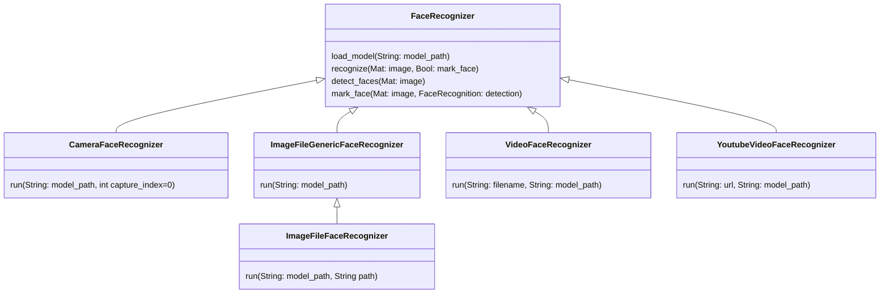

# find-people-in-videos

This is the source code for the exam of "Skriptsprachen WS22/23"



## Getting started

```shell
pip install -r requirements.txt
```

This command prepares the project and installs the necessary packages.

### Detect Faces

**Face recognition with webcam**

```shell
python -m src.recognizers.CameraFaceRecognizer
```

**Image folder without recognition**

```shell
python -m src.recognizers.ImageFileGenericFaceRecognizer
```

**Image folder with recognition**

```shell
python -m src.recognizers.ImageFileFaceRecognizer
```

**Face recognition in video**

```shell
python -m src.recognizers.VideoFaceRecognizer
```

**Face recognition in youtube video**

```shell
python -m src.recognizers.YoutubeVideoFaceRecognizer
```

## Links

- [Getting Stared with OpenCV](https://learnopencv.com/getting-started-with-opencv/)

- [Reading and Writing Videos using OpenCV | LearnOpenCV](https://learnopencv.com/reading-and-writing-videos-using-opencv/)

- [Real-time Human Detection with OpenCV](https://thedatafrog.com/en/articles/human-detection-video/)

- [OpenCV Python TUTORIAL #4 for Face Recognition and Identification - YouTube](https://www.youtube.com/watch?v=PmZ29Vta7Vc)


## Documentation

- Build with [pdoc – Generate API Documentation for Python Projects](https://pdoc.dev/)
- To Build the docs:
  
```shell
pdoc .\src\ -o ./docs
```